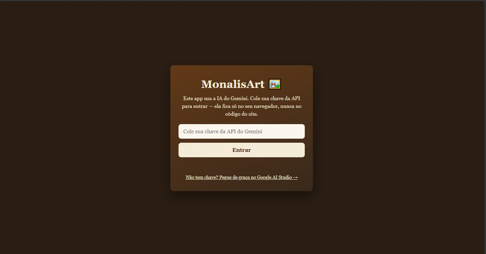
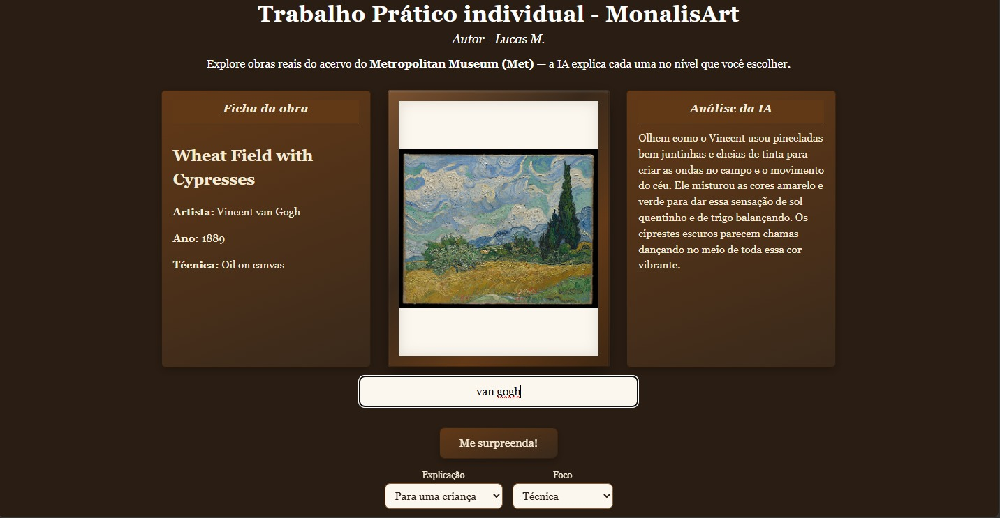

# MonalisArt 🖼️

Web app que combina a **API do Metropolitan Museum (Met)** com a **IA Gemini**: busque uma obra real do acervo do Met e receba uma análise gerada pela IA, adaptada ao nível e ao foco que você escolher.

🔗 **Acesse online:** https://culasss.github.io/MonalisArt-IF/

## 🧰 Stack
- **HTML + CSS + JavaScript** puros (sem frameworks, site estático)
- **[Met Museum API](https://metmuseum.github.io/)** — dados e imagens das obras (grátis, sem chave)
- **[Google Gemini API](https://ai.google.dev/)** — análise das obras (modelo `gemini-2.5-flash-lite`)
- **GitHub Pages** — hospedagem

## 🚀 Instalação
Não tem build. É só clonar e servir os arquivos estáticos:
```bash
git clone https://github.com/cuLasss/MonalisArt-IF.git
cd MonalisArt-IF
python -m http.server      # ou, no VS Code, a extensão "Live Server" → "Go Live"
```
Abra `http://localhost:8000`. (Ou use direto o link online acima — sem instalar nada.)

## 🕹️ Como usar
1. Pegue uma **chave grátis** do Gemini no [Google AI Studio](https://aistudio.google.com/app/apikey) → *Create API key*.
2. Cole a chave na tela de entrada e clique em **Entrar** (ela fica só no seu navegador, nunca no código).
3. **Busque** uma obra — ex: `Van Gogh`, `Monet`, `Rembrandt` — ou clique em **"Me surpreenda"**.
4. Escolha o **nível** (criança / leigo / conhecedor) e o **foco** (técnica / história…). A análise da IA muda conforme suas escolhas.

## 📸 Telas



---
Autor: **Lucas M.** — [@cuLasss](https://github.com/cuLasss)
